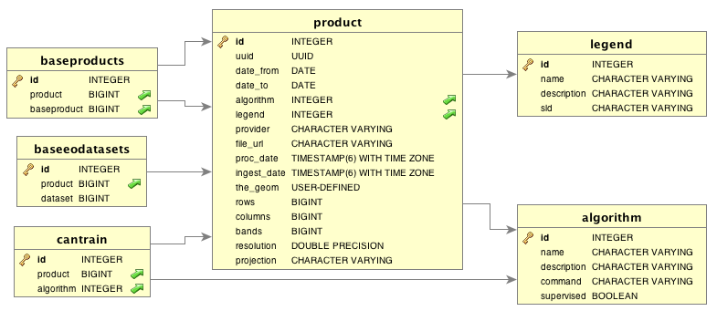

#Tecnical Documentation of MAD-Mex System

##System Architecture

The system is designed to be installed in two different ways:

* cluster: The components are installed on a set of computers that form a cluster. One of the nodes is responsible for distributing jobs to the slave nodes. It is the most efficient way to use when you have necessary resources.

* standalone: The whole system is installed on a single mainframe, it will be responsible for making all processing. It is not recommended when there are time restrictions for obtaining products.

Below is a diagram showing the system architecture in cluster mode:

## Data Base

##System Requirements Cluster Mode

For proper operation of the system, a set of minimum requirements are necessary. Below is a brief description.

###Hardware Master Nodo
- minimum: 2-4 vCPUs
- minimum: 4 GB RAM
- Memory: 50 GB 
- ssh: 22/tcp

###Hardware Slave Nodo
- minimum: 16 vCPUs
- minimum: 64GB RAM
- Memory: 50GB
- ssh: 22/tcp

CONABIO's cluster, that is used to house the system MAD-Mex, has the following characteristics:

- 1 Master Node with 64 GB RAM memory
- 4 Worker Nodes with 128GB RAM memory
- 1 Worker Node with 256 GB RAM memory
- 1 Services Node with 256 GB RAM memory

Every node communicates via infiniband with a distributed LUSTRE file system.

###Sofware

####Python

Python is the programming language in which MADMex is implemented. The recommended Python version is 2.7.10, with the following libraries:

- aniso8601 versión 0.82
- astroid versión 1.3.6
- boto versión 2.38.0
- coverage versión 3.7.1
- crcmod versión 1.7
- cryptography versión 1.2.2
- decorator versión 4.0.9
- drmaa versión 0.7.6
- ecdsa versión 0.13
- enum34 versión 1.1.2
- ephem versión 3.7.5.3
- Flask versión 0.10.1
- Flask-RESTful versión 0.2.12
- GDAL versión 1.11.2
- GeoAlchemy versión 0.7.2
- GeoAlchemy2 versión 0.2.3
- google-api-python-client versión 1.4.2
- google-apitools versión 0.4.12
- gsutil versión 4.16
- httplib2 versión 0.9.2
- mahotas versión 1.1.0
- MarkupSafe versión 0.21
- matplotlib versión 1.4.3
- numpy versión 1.8.0
- pandas versión 0.13.1
- paramiko versión 1.15.2
- psycopg2 versión 2.5.1
- pyephem versión 3.7.5.3
- pyparsing versión 2.0.3
- pysql versión 0.16
- pystache versión 0.5.4
- python-fmask versión 0.2.1
- python-gflags versión 2.0
- pytz versión 2013.9
- requests versión 2.2.1
- scikit-image versión 0.11.3
- scikit-learn versión 0.14.1
- scipy versión 0.12.0
- six versión 1.5.2
- SQLAlchemy versión 0.8.2

Also, it is recommended to use the most common methods to isolate a Python environment, such as [virtual environment](https://virtualenv.pypa.io/en/latest/installation.html).

####Docker

The MAD-Mex system uses Docker containers to virtualize environments and make them available on different platforms without the usual difficulties. Some processes within MAD-Mex can only be executed on specific operating systems. In order not to require users to have such distributions, those processes run within the Docker containers. This guide is not intended to teach the user the use and development of these containers, for a guide on how to install and use Docker, you can consult the following links:

- [Instalación](https://docs.docker.com/engine/installation/)
- [Uso](https://docs.docker.com/mac/)

Al instalar Docker via Docker Toolbox, se instalará automáticamente una máquina virtual VirtualBox, en ella correran los contenedores.

####Geospatial Data Abstraction Library (GDAL)

La librería GDAL es necesaria para el uso y manipulación de imagenes geoespaciales en distintos formatos. La instalación de GDAL es un prerequisito para varios sistemas de información geográfica. Para el caso específico de MAD-Mex es necesario instalar, además, los bindings para hacer uso de GDAL desde al ambiente Python. A continuación las ligas necesarias:

- [Instalation](https://trac.osgeo.org/gdal/wiki/DownloadingGdalBinaries)
- [Bindings of Python instalation](https://pypi.python.org/pypi/GDAL/)

####PostgreSQL

PostgreSQL is the database engine that the MAD-Mex system uses to store reference of the files and products that have been ingested in the system. In addition, a PostgreSQL extension called PosGIS is used to make spatial queries about the information. To install these dependencies:

- [PostgreSQL instalation](http://www.postgresql.org/download/)
- [PosGIS instalation](http://postgis.net/install/)

In order to view the database's information in a simple way, it is recommended to install a client for the database. DbVisualizer is the recommended option:

- [DbVisualizer instalation](https://www.dbvis.com/download/)

####QGIS

The MAD-Mex system produces multi-band high resolution images. These images can not be viewed by traditional methods. In order to make use of them, the installation of the geographical information system QGIS is recommended. As with the previous requirements, learning about the use of the system remains as an exercise for the reader:

- [QGIS instalation](http://www.qgis.org/en/site/forusers/download.html)

