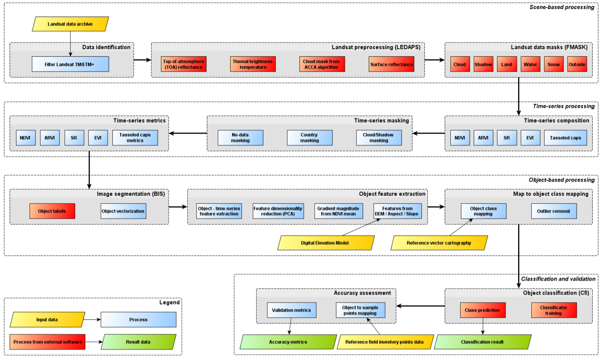

#MAD-Mex's system theory

##Land cover

There are important concepts such as land cover, which refers to the morphology of the surface and describes the physical material of the Earth also considering human activity, thus defining closely cover classes with their physical characteristics. Classes are relatively easy to discern by measurements of remote sensors, which record the spectral response of the different types of surfaces. Examples of land cover classes are; forest, water bodies and bare soils, which are also commonly subdivided, e.g. in coniferous forest and broadleaf or deciduous or evergreen. 

##Land cover classifiation

The classification system of land cover ([LCCS](http://www.fao.org/docrep/003/x0596e/x0596e00.HTM)) was developed by the Food and Agriculture Organization (FAO) of the United Nations. It is an effort of description of soil cover classes in a standardized manner which is divided into two phases: dichotomous and hierarchical-modular. The system facilitates the interpretation of the legend and harmonization of cartography.
Classification is an abstract representation of the real situation in the field using well defined diagnostic criteria called classifiers. They are defined by Sokal (1974), as "the arrangement or ordering of objects in groups or sets on the basis of their relations." A classification describes the systematic scheme with the names of the classes and the criteria used to distinguish them, and the relationship between classes. So the classification requires the definition of class boundaries, which must be clear, precise, if possible quantitative, and based on objective criteria.

##Change detection  in land cover classification 

Change detection is to identify differences in the state of a feature or phenomenon by observations made at different times. Detecting changes in the MADMex system is based on the bitemporal comparison of images, for both reference periods in processing Landsat and for the annual processing of RapidEye. Bitemporal detecting changes is performed by the algorithm iMAD (Multivariate Alteration Detection transformation) and post-processing algorithm based on the MAF (Autocorrelation Factor Maximum transformation).

## Workflow classification process (LANDSAT)

##MAD Transform

The MAD transform (Multivariate Alteration Detection) is based on a multivariate analysis which establishes the canonical correlation of changes between bands. This scheme transforms two sets of multivariate observations in a difference between two linear combinations of the original varibales, these differences quantify the maximum change in all variables simultaneously. The MAD transformation is invariant to linear scale and can be used iteratively. In the first instance, it can be used to detect outliers or noise and in a second iteration, can be used for detecting real change after the appropriate action in atypical or noise values.
Due to the capacity to detect changes in the channels simultaneously, processing and post-processing MAD/MAF is even more useful when applies to a larger number of bands in which the changes are noted.

##MAF Transform

In order to improve the spatial coherence of the change components, MAF transform (Maximum Autocorrelation Factor) is applied to MAD components. Assuming that the image noise is calculated as the difference between the intensities of the neighboring pixels, the MAF transform is equivalent to a minimum noise fraction transform (MNF), generating image components with a maximum signal to noise ratio. Also MAF transform is invariant to linear scale.

## Fmask algorithm

The fmask algorithm relates clouds with their shadows based on similarity measurements. This algorithm iterates from a minimal height possible to a maximum height and calculates the similarity between the cloud and cloud shadow, this makes for clouds at different heights.
The original Fmask algorithm, test cloud height continues if the similarity continues increasing or not decrease below 98% of maximum similarity measure; otherwise, the cloud height search stops and cloud shadow is associated with the maximum similarity. However,
sometimes the iteration may stop before it should, such as the similarity does not reach its maximum value; this may be because there are local maximum which are 2% larger than the similarity measure for the height of neighboring clouds. In the improved fMask algorithm, the relationship between the cloud's shadow and the cloud will not stop unless the similarity value is reduced to 95% of maximum similarity value.

