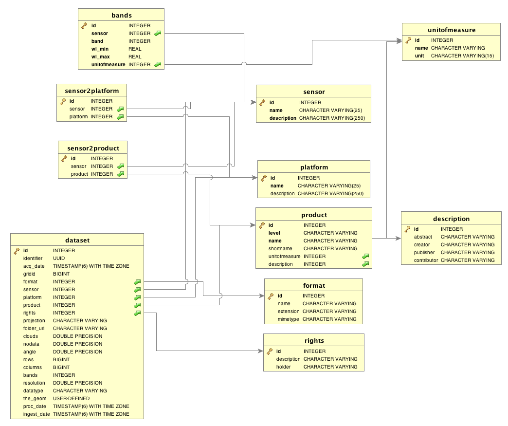

#Documentación Técnica del Sistema MAD-Mex

##Arquitectura del Sistema

El sistema está diseñado para poder ser instalado de dos formas:

* cluster: Los componentes se instalan en un conjunto de computadoras que forman un cluster. Uno de los nodos se encarga de distribuir trabajos a los nodos esclavo. Está es la forma más eficiente de uso cuando se cuentan con los recursos necesarios.

* standalone: El sistema en su totalidad se instala en un solo mainframe, este será encargado de hacer todo el procesamiento. Es poco recomendable cuando existen restricciones de tiempo para la obtención de los productos.

A continuación se muestra un diagrama que representa la arquitectura del sistema en modo de cluster:

## Base de Datos

##Requerimientos del Sistema en Modo Cluster

Para el correcto funcionamiento del sistema, un conjunto de requerimientos mínimos es necesario. A continuación se ofrece una breve descripción.

###Hardware Nodo Maestro
- mínimo: 2-4 vCPUs
- mínimo: 4 GB RAM
- 50 GB Memory
- ssh: 22/tcp

###Hardware Nodo Esclavo
- mínimo: 16 vCPUs
- mínimo: 64GB RAM
- memoria: 50GB
- ssh: 22/tcp

En la CONABIO, el cluster que se usa para albergar el sistema MAD-Mex cuenta con las siguientes características:

- 1 Nodo maestro de 64 GB de memoria RAM
- 4 Nodos de procesamiento de 128GB de memoria RAM
- 1 Nodo de procesamiento de 256 GB de memoria RAM
- 1 Nodo de servicios de 256 GB de memoria RAM

Y cada nodo se comunica vía infiniband con un sistema de archivos distribuido LUSTRE.

###Sofware

####Python

El lenguaje de programación en el que MADMex está implementado es Python. La version de Python recomendada es la 2.7.10, con las siguientes librerías:

- aniso8601 versión 0.82
- astroid versión 1.3.6
- boto versión 2.38.0
- coverage versión 3.7.1
- crcmod versión 1.7
- cryptography versión 1.2.2
- decorator versión 4.0.9
- drmaa versión 0.7.6
- ecdsa versión 0.13
- enum34 versión 1.1.2
- ephem versión 3.7.5.3
- Flask versión 0.10.1
- Flask-RESTful versión 0.2.12
- GDAL versión 1.11.2
- GeoAlchemy versión 0.7.2
- GeoAlchemy2 versión 0.2.3
- google-api-python-client versión 1.4.2
- google-apitools versión 0.4.12
- gsutil versión 4.16
- httplib2 versión 0.9.2
- mahotas versión 1.1.0
- MarkupSafe versión 0.21
- matplotlib versión 1.4.3
- numpy versión 1.8.0
- pandas versión 0.13.1
- paramiko versión 1.15.2
- psycopg2 versión 2.5.1
- pyephem versión 3.7.5.3
- pyparsing versión 2.0.3
- pysql versión 0.16
- pystache versión 0.5.4
- python-fmask versión 0.2.1
- python-gflags versión 2.0
- pytz versión 2013.9
- requests versión 2.2.1
- scikit-image versión 0.11.3
- scikit-learn versión 0.14.1
- scipy versión 0.12.0
- six versión 1.5.2
- SQLAlchemy versión 0.8.2

Así mismo, se recomienda el uso de los métodos más comunes para aislar un ambiente de Python, por ejemplo [virtual environment](https://virtualenv.pypa.io/en/latest/installation.html).

####Docker

El sistema MAD-Mex hace uso de contenedores Docker para virtualizar ambientes y hacerlos disponibles en las distintas plataformas sin las dificultades usuales. Algunos de los procesos dentro de MAD-Mex solo pueden ser ejecutados en sistemas operativos específicos. Con el fin de no requerir que los usuarios cuenten con dichas distribuciones, esos procesos corren dentro de los contenedores Docker. Esta guia no prende enseñar al usuario el uso y desarrollo de dichos contenedores, para una guia de como instalar y usar Docker, se pueden consultar las siguientes ligas:

- [Instalación](https://docs.docker.com/engine/installation/)
- [Uso](https://docs.docker.com/mac/)

Al instalar Docker via Docker Toolbox, se instalará automáticamente una máquina virtual VirtualBox, en ella correran los contenedores.

####Geospatial Data Abstraction Library (GDAL)

La librería GDAL es necesaria para el uso y manipulación de imagenes geoespaciales en distintos formatos. La instalación de GDAL es un prerequisito para varios sistemas de información geográfica. Para el caso específico de MAD-Mex es necesario instalar, además, los bindings para hacer uso de GDAL desde al ambiente Python. A continuación las ligas necesarias:

- [Instalación](https://trac.osgeo.org/gdal/wiki/DownloadingGdalBinaries)
- [Instalación de bindings de Python](https://pypi.python.org/pypi/GDAL/)

####PostgreSQL

PostgreSQL es el motor de base de datos que el sistema MAD-Mex usa para guardar referencia de los archivos y productos que han sido ingestados en el sistema. Adicionalmente se usa una extensión de PostgreSQL llamada PosGIS para poder hacer consultas espaciales sobre la información. Para instalar estas dependencias:

- [Instalación PostgreSQL](http://www.postgresql.org/download/)
- [Instalación PosGIS](http://postgis.net/install/)

Para poder visualizar la información de la base de datos de una manera sencilla, se recomienda la instalación de un cliente para la base de datos. DbVisualizer es la opción recomendada:

- [Instalación DbVisualizer](https://www.dbvis.com/download/)

####QGIS

El sistema MAD-Mex produce imagenes multi banda de alta resolución. Estás imágenes no pueden ser visualizadas por métodos tradicionales. Para hacer uso de las mismas, se recomienda la instalación del sistema de información geográfica QGIS. Al igual que con los requisitos anteriores, el aprendizaje sobre el uso del sistema queda como ejercicio para el lector:

- [Instalación QGIS](http://www.qgis.org/en/site/forusers/download.html)

