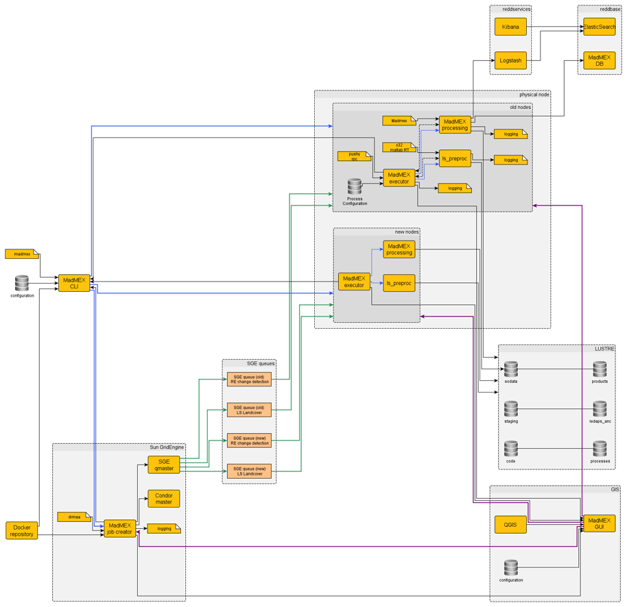

#Documentación Técnica del Sistema MAD-Mex

##Arquitectura del Sistema

El sistema está diseñado para poder ser instalado de dos formas:

* cluster: Los componentes se instalan en un conjunto de computadoras que forman un cluster. Uno de los nodos se encarga de distribuir trabajos a los nodos esclavo. Está es la forma más eficiente de uso cuando se cuentan con los recursos necesarios.

* standalone: El sistema en su totalidad se instala en un solo mainframe, este será encargado de hacer todo el procesamiento. Es poco recomendable cuando existen restricciones de tiempo para la obtención de los productos.

A continuación se muestra un diagrama que representa la arquitectura del sistema en modo de cluster:

##Requerimientos del Sistema en Modo Cluster

Para el correcto funcionamiento del sistema, un conjunto de requerimientos mínimos es necesario. A continuación se ofrece una breve descripción.

###Hardware Nodo Maestro
- mínimo: 2-4 vCPUs
- mínimo: 4GB RAM
- 50GB Memory
- ssh: 22/tcp

###Hardware Nodo Esclavo
- mínimo: 16 vCPUs
- mínimo: 64GB RAM
- memoria: 50GB
- ssh: 22/tcp

